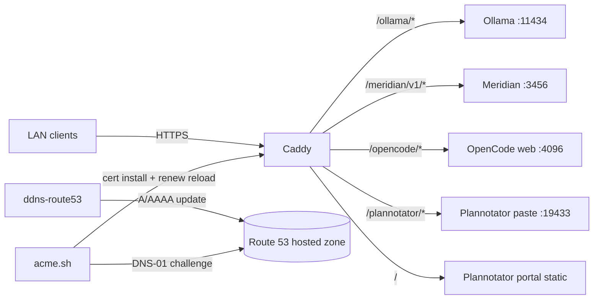

# Caddy LAN Exposure

> Caddy reverse proxy for LAN-safe exposure of local AI tools.
> See [AGENTS.md](../AGENTS.md) for repo-wide agent guidance.

## Overview

Caddy publishes selected local AI services to `localhost`, the LAN, or public domains with real TLS, host allowlisting, and `basic_auth`.
It is the front door for:

- Ollama inference
- Meridian `/v1`
- OpenCode web (optional)
- Plannotator paste + static portal

## Architecture

### Core components

1. **ddns-route53** — keeps Route 53 records pointed at this machine.
2. **acme.sh** — issues and renews a real certificate with Route 53 DNS-01.
3. **Caddy** — terminates TLS and reverse proxies traffic to local services.
4. **Root LaunchDaemon (`com.caddy.proxy`)** — runs Caddy as root on `:443` while setting `HOME` to the real user home so `tls internal` can find the PKI store under `~/Library/Application Support/Caddy/pki/`.

### Optional services

5. **OpenCode web** — `opencode web` behind Caddy.
6. **Plannotator paste** — encrypted paste backend behind Caddy; portal is static.



## Multi-domain + multi-zone

`~/.config/caddy/ddns-zones.json` is the machine-local source of truth for DDNS.
It replaces the old `ROUTE53_HOSTED_ZONE_ID` / `DDNS_RECORD_NAME` / `DDNS_RECORD_TTL`
environment-variable setup.

`configure-ddns.py` reads that file and writes one LaunchAgent per zone/record set,
so one machine can keep multiple domains updated without duplicating repo config.

Typical zone entries include:

- Route 53 hosted zone ID
- one or more DNS record names
- TTL for each record set
- optional per-zone host or access mapping

## CADDY_ACCESS enum

`CADDY_ACCESS` controls how Caddy generates listeners and TLS for a machine.

| Mode | Generated config |
|------|------------------|
| `localhost` | `https://localhost` with `tls internal`; loopback-only upstreams. |
| `lan` | LAN hostnames with real TLS, `remote_ip private_ranges`, and DDNS updates. |
| `public` | Public hostnames with real TLS and DDNS updates; no LAN-only IP restriction. |

`localhost` is the safest default. Use `lan` when you want private-network access,
and `public` when you intentionally want internet-reachable exposure.

`CADDY_HTTPS_PORT` defaults to `443` for the root LaunchDaemon. When set to
`443`, site addresses render as `https://host` (no explicit port).

## Machine-local config files

Create these files on each machine; they are not tracked in the repo:

- `~/.config/caddy/ddns-zones.json` — zone + record definitions used by `configure-ddns.py`
- `~/.config/caddy/caddy-auth.conf` — shared auth snippet(s) imported by Caddy

Both paths are exposed as env vars so scripts can be pointed at alternate locations:

- `CADDY_ZONES_CONFIG`

## Multi-user auth

`~/.config/caddy/caddy-auth.conf` is a machine-local Caddy snippet that can be
imported into one or more site blocks. It is the only auth source for Caddy v2;
env vars are not used for basic auth.

Typical content looks like:

```caddyfile
basic_auth {
  alice <hash>
  bob <hash>
}
```

Generate password hashes with `caddy hash-password`; add `user:hash` entries
directly to `caddy-auth.conf`.

## Security model

Caddy exposure is layered:

1. **TLS** — acme.sh obtains real certificates with Route 53 DNS-01.
2. **LAN allowlist** — `remote_ip private_ranges` limits requests to private networks.
3. **Basic auth** — `basic_auth` hard-fails unauthenticated requests.

## Localhost access

When `CADDY_ACCESS=localhost`, Caddy serves `https://localhost` and uses
`tls internal` so the local machine can trust its own certificate authority.
This mode skips DDNS and Route 53 entirely and is useful for development-only
web UIs.

Trust the local root CA with `caddy trust`, or install the root certificate
manually if you prefer to manage Keychain trust yourself.

## Exposed services

| Service | Path | Upstream | Notes |
|---------|------|----------|-------|
| Ollama | `/ollama/*` | `http://127.0.0.1:11434` | Read-only proxy; write endpoints are blocked. |
| Meridian | `/meridian/v1/*` | `http://127.0.0.1:3456` (default) | OpenAI-compatible API surface only. |
| OpenCode web | `/opencode/*` | `http://127.0.0.1:4096` | WebSocket-aware; gated by `DOTFILES_RUN_OPENCODE_WEB_SETUP=1`; Caddy `basic_auth` is the only external auth layer. |
| Plannotator paste | `/plannotator/*` | `http://127.0.0.1:19433` | Encrypted-payload paste backend. |
| Plannotator portal | `/` | static files | Static share portal; no backend control plane exposed. |

## Not exposed

| Service | Why not exposed |
|---------|------------------|
| JetBrains MCP | IDE control plane; exposing it would grant remote IDE control. |
| Mozart | Router config, not a network service. |
| CodeGraph | stdio MCP only; no LAN HTTP server. |

## Environment variables

### Caddy

| Variable | Purpose |
|----------|---------|
| `CADDY_ACCESS` | Access mode: `localhost`, `lan`, or `public`. |
| `CADDY_HTTPS_PORT` | HTTPS listen port (default `443`). |
| `CADDY_ZONES_CONFIG` | Machine-local DDNS zone config (`~/.config/caddy/ddns-zones.json`). |
| `CADDY_BIND_IP` | Auto: `ipconfig getifaddr en0`, fallback `0.0.0.0`. |
| `CADDY_HOSTNAME` | Auto: chezmoi hostname. |

`caddy-auth.conf` is the only place Caddy auth credentials are read from.

### Route 53 / ddns-route53 / acme.sh

| Variable | Purpose |
|----------|---------|
| `ROUTE53_AWS_ACCESS_KEY_ID` | Required AWS key for Route 53 (ddns + acme.sh). |
| `ROUTE53_AWS_SECRET_ACCESS_KEY` | Required AWS secret for Route 53. |
| `ACME_EMAIL` | Required acme.sh account email. |

Compatibility note: `ROUTE53_AWS_ACCESS_KEY_ID` and `ROUTE53_AWS_SECRET_ACCESS_KEY` can be populated from the existing `AWS_ACCESS_KEY_ID` / `AWS_SECRET_ACCESS_KEY` values if you prefer a single credential source in `~/.env`.

The Route 53 zone ID, record names, and TTL now live in
`~/.config/caddy/ddns-zones.json` instead of `~/.env`.

### OpenCode web

OpenCode binds to `127.0.0.1` only, so the web service is reachable locally
without credentials. The TUI also connects directly to localhost and does not
need OpenCode-level auth.

Caddy's `basic_auth` from `~/.config/caddy/caddy-auth.conf` is the sole auth
boundary for external access to `/opencode/*`.

The generated `opencode.json` contains the `server` block used by `opencode web`
(`port`, `hostname`, and `cors`). When `DOTFILES_RUN_OPENCODE_WEB_SETUP=1`, the
LaunchAgent keeps that server running so Caddy can proxy `/opencode/*` to it.

### Plannotator

| Variable | Purpose |
|----------|---------|
| `PLANNOTATOR_PORT` | Share portal port. |
| `PASTE_PORT` | Paste backend port. |
| `PLANNOTATOR_DATA_DIR` | Share portal data directory. |
| `PASTE_DATA_DIR` | Paste storage directory. |
| `PASTE_TTL_DAYS` | Paste retention window. |
| `PASTE_MAX_SIZE` | Maximum paste size in bytes. |
| `PASTE_ALLOWED_ORIGINS` | CORS allowlist for the paste backend. |

The repo uses the upstream Plannotator paste env var names directly.

## Setup steps

1. Set the environment variables in `~/.env`.
2. Run `make migrate` to clean deprecated Caddy auth env vars from `~/.env`.
3. Run `make caddy-migrate` once to decommission the old dedicated-user setup.
4. Run `make deploy` to generate config and apply services.
5. Run `make caddy-validate` to verify the generated Caddyfile.
6. If you use `tls internal`, run `caddy trust` once (or install the root CA manually) so browsers trust the local CA.

## Migration notes

The migration step decommissions the legacy dedicated-user setup:

- `acme` and `ddnsr53` users/groups
- `/etc/acmesh`
- `/etc/ddns-route53`
- old LaunchDaemons for ACME / DDNS automation

The new setup runs as a root LaunchDaemon, but Caddy's `HOME` is set to the real
user home so its PKI store remains under the user Library tree.

`make caddy-deploy` restarts the daemon with `sudo launchctl bootout/bootstrap`
and `make caddy-reload` uses `sudo` for the reload command.

`make migrate` handles the env-var rename/cleanup, while `make caddy-migrate`
removes the old dedicated-user runtime pieces.

## Troubleshooting

- **Certificate renewal fails**: verify `ACME_EMAIL`, Route 53 credentials, and hosted zone access.
- **DDNS does not update**: confirm `ddns-zones.json` has the right hosted zone and AWS credentials can edit it.
- **Caddy will not start**: validate the Caddyfile with `make caddy-validate`; confirm `~/.config/caddy/caddy-auth.conf` exists and has valid `user:hash` entries.
- **Need a password hash**: run `caddy hash-password` and add the result to `~/.config/caddy/caddy-auth.conf`.

## Links

- [docs/TIERS.md](TIERS.md)
- [AGENTS.md](../AGENTS.md)
