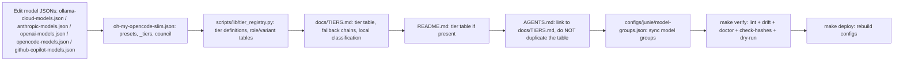

# Model and Tier Updates

> One-page checklist for coordinated model, provider, and tier changes.

Use this playbook when adding or changing models, switching tiers, or updating provider configuration. Keep the source JSON, tier behavior, documentation, and generated configuration aligned.

## Update Flow

## Checklist

- [ ] Update the applicable model catalog(s): `configs/opencode/ollama-cloud-models.json`, `configs/opencode/anthropic-models.json`, `configs/opencode/openai-models.json`, `configs/opencode/opencode-models.json`, and/or `configs/opencode/github-copilot-models.json`. `make check-slim-invariants` fails if any model referenced in `oh-my-opencode-slim.json` is missing from its catalog — run it directly for fast feedback when adding models.
- [ ] Update `configs/opencode/oh-my-opencode-slim.json`: `presets`, `_tiers`, council entries, fallback chains, and the active preset as needed.
- [ ] Update `scripts/lib/tier_registry.py` for tier registry access, role mappings, variants, or local placeholder behavior.
- [ ] Update `scripts/configure-opencode-tier.py` when tier switch logic, cloud proxy, or role assignment overrides change.
- [ ] Update `scripts/configure-opencode.py` when provider inclusion, tier validation, or model catalog loading changes.
- [ ] Update `docs/TIERS.md` with the tier table, role/variant details, fallback chains, and local classification rules.
- [ ] Update `README.md` tier information, if a tier table or model summary is present.
- [ ] Update `AGENTS.md` links/reference entries as needed; link to `docs/TIERS.md` rather than duplicating its tier table.
- [ ] Sync `configs/junie/model-groups.json` providers, groups, primary/faster models, and temperature coverage.
- [ ] If introducing a `DOTFILES_*` environment variable, document it in `.env.example`.
- [ ] If adding config inputs, add their chezmoi hash triggers before verification.

## Common pitfalls

> [!WARNING]
> - Forgetting to sync `configs/junie/model-groups.json` (changed 16× and often correlated with model updates).
> - Duplicating the tier table in `AGENTS.md` instead of linking to `docs/TIERS.md`.
> - Forgetting to update `.env.example` when introducing a new `DOTFILES_*` environment variable.
> - Not running `make check-hashes` after adding config inputs.

## Verification

1. Run `make verify` (lint, drift, doctor, hash checks, and dry-run).
2. Run `make deploy` to rebuild generated configurations.
3. Restart OpenCode if a preset changed; runtime-safe model fields alone may not require a restart.

## 2026-09-01: Anthropic/Ollama Cloud Equivalence Alignment

The approved cost-tier alignment maps Anthropic model families to Ollama Cloud
IDs (OpenCode convention, without the local proxy's `:cloud` suffix):

| Anthropic | Ollama Cloud | Use |
|-----------|--------------|-----|
| `claude-fable-5-1` | `kimi-k3` | Oracle |
| `claude-opus-5` | `glm-5.3` | Council |
| `claude-sonnet-5` | `glm-5.3-flash` | Orchestrator |
| `claude-haiku-4.5` | `gemma4:31b` | Librarian, explorer, fixer |
| `claude-sonnet-4.6` | `deepseek-v4-flash` | Utility |

The `pro` tier now uses `glm-5.3-flash` for orchestrator and designer,
`kimi-k3` for oracle, `gemma4:31b` for librarian/explorer, `deepseek-v4-flash`
for fixer, and `glm-5.3` for council synthesis. This is cost-tier alignment,
not proven capability parity. GLM-5.3-Flash and Gemma4 benchmark claims are
vendor-reported. The pricing basis used was OpenRouter per-million-token
pricing: GLM-5.3 `$1.40/$4.40`, Kimi K3 `$3/$15`, GLM-5.3-Flash
`$0.075/$0.25`, and DeepSeek V4 Flash approximately `$0.05/$0.10`, compared
with Opus 5 at `$5/$25` (input/output).

## Drift check & sync reminder

`make check-model-drift` validates checked-in model allowlists, live local
Ollama models, and deployed Junie profile endpoints and model IDs. It warns
when a live endpoint is unavailable, but reports catalog or deployed-profile
model mismatches as drift.

Successful profile generation by `scripts/generate-jetbrains-profiles.py`
writes the last-sync stamp to `~/.local/share/dotfiles/model-sync-stamp`.
The stamp is considered stale after 14 days. Re-run `make deploy` after any
model announcement that affects your presets; `make verify` warns when the
14-day cadence has elapsed. See the [orchestration script inventory](ORCHESTRATION.md#script-inventory)
for the automated check.

## 2026-09-12: Ollama Cloud + OpenAI catalogue refresh

- Added to ollama-cloud allowlist: `deepseek-v4.1-flash`, `glm-5.1`, `nemotron-3-super` (catalogue verified 2026-09-12 vs ollama.com/search?c=cloud).
- Added `gpt-6-astra` to openai allowlist (flagship, 1.05M ctx/128K output, per developers.openai.com/api/docs/models).
- plus council γ: gpt-5.4 → gpt-5.6-terra. plus/plus-anthropic gpt-5.4-mini chain entries removed where OpenAI's mapped replacement (gpt-5.6-luna) equals the role primary; gpt-6-astra added as plus/plus-anthropic orchestrator/oracle fallback head. gpt-5.4-mini remains in omo-slim-* observer chains.
- Dedup invariants enforced in `scripts/verify-slim-invariants.py`: primary-not-in-own-chain, no-repeat-in-chain.
- Ollama pricing facts for the tier-alignment record: Pro $20/mo, $60 monthly credits, 3 concurrent requests; Max $100/mo, $300 monthly credits, 10 concurrent (ollama.com/pricing, verified 2026-09-12; peak pricing 12:00–18:00 UTC Mon–Fri).
- Local variant calibration (2026-09-12): the five local tiers' uniform `max` variants were replaced with policy-conformant per-role variants (librarian/explorer/observer low, designer medium, fixer high, orchestrator medium, oracle/council max retained); Qwen3.8 reasoning stays enabled.
- Voice LLM model refresh (fleet sweep): `configure-opencode-voice.py` plus-tier OpenAI voice LLM model gpt-5.4-mini → `gpt-5.6-luna` (mini retired 2026-08-31; OpenAI-directed replacement; STT remains `whisper-1`), with test expectation updated.
- pro-plus-anthropic librarian fallback: removed `openai/gpt-5.4-mini` (retired 2026-08-31) — OpenAI's mapped replacement (`gpt-5.6-luna`) is already that role's primary, so the entry was redundant; `ollama-cloud/deepseek-v4-flash` fallback retained. Only remaining active slim-config `gpt-5.4-mini` references are the documented omo-slim-* observer chains.
- oMLX integration (commits `9108204` and `d37d124`): opt-in gate `DOTFILES_RUN_OMLX_SETUP`, merged local pool with Ollama collision precedence, OpenCode/Junie/Pi/ACP/Codex/voice/Caddy wiring, and live model drift checks.

## free preset (cross-provider free tier)

The `free` preset distributes work across free offerings from three
providers: OpenCode Zen free contributor models, the Google Gemini free tier,
and OpenRouter models with the `:free` suffix. It is intended for
cross-provider resilience and cost-free operation, not guaranteed capability
parity.

Free access has practical limits. OpenRouter allows 50 requests/day with less
than $10 in credits or 1,000 requests/day with at least $10 in credits, with a
20 RPM limit reported by `GET /api/v1/key`. Gemini limits are per project and
there is no universal RPM/RPD table; daily quotas reset at midnight Pacific
Time. OpenCode Zen contributor models should be reviewed for the applicable
privacy caveat before use.

When refreshing the preset, update the Google and OpenRouter allowlist files
first, then update `presets`, `council.presets`, and `_tiers` together. These
three locations must contain the same preset name. Keep fallback arrays
provider-deduplicated, avoid the role primary in its fallback, and leave the
council fallback empty. The repeatable workflow is in
[`configs/skills/free-preset/SKILL.md`](../configs/skills/free-preset/SKILL.md).
