# Model and Tier Updates

> One-page checklist for coordinated model, provider, and tier changes.

Use this playbook when adding or changing models, switching tiers, or updating provider configuration. Keep the source JSON, tier behavior, documentation, and generated configuration aligned.

## Update Flow

```mermaid
flowchart LR
  A[Edit model JSONs: ollama-cloud-models.json / anthropic-models.json / openai-models.json] --> B[oh-my-opencode-slim.json: presets, _tiers, council]
  B --> C[configure-opencode-tier.py: tier definitions, role/variant tables]
  C --> D[docs/TIERS.md: tier table, fallback chains, local classification]
  D --> E[README.md: tier table if present]
  E --> F[AGENTS.md: link to docs/TIERS.md, do NOT duplicate the table]
  F --> G[configs/junie/model-groups.json: sync model groups]
  G --> H[make verify: lint + drift + doctor + check-hashes + dry-run]
  H --> I[make deploy: rebuild configs]
```

## Checklist

- [ ] Update the applicable model catalog(s): `configs/opencode/ollama-cloud-models.json`, `configs/opencode/anthropic-models.json`, and/or `configs/opencode/openai-models.json`.
- [ ] Update `configs/opencode/oh-my-opencode-slim.json`: `presets`, `_tiers`, council entries, fallback chains, and the active preset as needed.
- [ ] Update `scripts/configure-opencode-tier.py` for tier definitions, role mappings, variants, or local placeholder behavior.
- [ ] Update `scripts/configure-opencode.py` when provider inclusion, tier validation, or model catalog loading changes.
- [ ] Update `docs/TIERS.md` with the tier table, role/variant details, fallback chains, and local classification rules.
- [ ] Update `README.md` tier information, if a tier table or model summary is present.
- [ ] Update `AGENTS.md` links/reference entries as needed; link to `docs/TIERS.md` rather than duplicating its tier table.
- [ ] Sync `configs/junie/model-groups.json` providers, groups, primary/faster models, and temperature coverage.
- [ ] If introducing a `DOTFILES_*` environment variable, document it in `.env.example`.
- [ ] If adding config inputs, add their chezmoi hash triggers before verification.

## Common pitfalls

> [!WARNING]
> - Forgetting to sync `configs/junie/model-groups.json` (changed 16× and often correlated with model updates).
> - Duplicating the tier table in `AGENTS.md` instead of linking to `docs/TIERS.md`.
> - Forgetting to update `.env.example` when introducing a new `DOTFILES_*` environment variable.
> - Not running `make check-hashes` after adding config inputs.

## Verification

1. Run `make verify` (lint, drift, doctor, hash checks, and dry-run).
2. Run `make deploy` to rebuild generated configurations.
3. Restart OpenCode if a preset changed; runtime-safe model fields alone may not require a restart.
