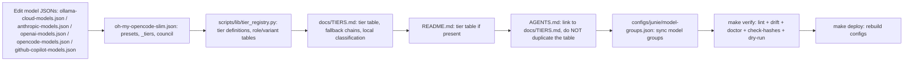

# Model and Tier Updates

> One-page checklist for coordinated model, provider, and tier changes.

Use this playbook when adding or changing models, switching tiers, or updating provider configuration. Keep the source JSON, tier behavior, documentation, and generated configuration aligned.

## Update Flow

```mermaid
flowchart LR
  A[Edit model JSONs: ollama-cloud-models.json / anthropic-models.json / openai-models.json / opencode-models.json / github-copilot-models.json] --> B[oh-my-opencode-slim.json: presets, _tiers, council]
  B --> C[scripts/lib/tier_registry.py: tier definitions, role/variant tables]
  C --> D[docs/TIERS.md: tier table, fallback chains, local classification]
  D --> E[README.md: tier table if present]
  E --> F[AGENTS.md: link to docs/TIERS.md, do NOT duplicate the table]
  F --> G[configs/junie/model-groups.json: sync model groups]
  G --> H[make verify: lint + drift + doctor + check-hashes + dry-run]
  H --> I[make deploy: rebuild configs]
```

## Checklist

- [ ] Update the applicable model catalog(s): `configs/opencode/ollama-cloud-models.json`, `configs/opencode/anthropic-models.json`, `configs/opencode/openai-models.json`, `configs/opencode/opencode-models.json`, and/or `configs/opencode/github-copilot-models.json`. `make check-slim-invariants` fails if any model referenced in `oh-my-opencode-slim.json` is missing from its catalog — run it directly for fast feedback when adding models.
- [ ] Update `configs/opencode/oh-my-opencode-slim.json`: `presets`, `_tiers`, council entries, fallback chains, and the active preset as needed.
- [ ] Update `scripts/lib/tier_registry.py` for tier registry access, role mappings, variants, or local placeholder behavior.
- [ ] Update `scripts/configure-opencode-tier.py` when tier switch logic, cloud proxy, or role assignment overrides change.
- [ ] Update `scripts/configure-opencode.py` when provider inclusion, tier validation, or model catalog loading changes.
- [ ] Update `docs/TIERS.md` with the tier table, role/variant details, fallback chains, and local classification rules.
- [ ] Update `README.md` tier information, if a tier table or model summary is present.
- [ ] Update `AGENTS.md` links/reference entries as needed; link to `docs/TIERS.md` rather than duplicating its tier table.
- [ ] Sync `configs/junie/model-groups.json` providers, groups, primary/faster models, and temperature coverage.
- [ ] Check every changed **wire ID** in the refreshed catalogue for its actual endpoint and credential scope. Keep configured IDs a curated subset of available IDs; do not copy the full catalogue. Preserve inner slashes, tags, and Ollama's distinct `:cloud`/`-cloud` installed stub names. Do not use another provider's matching leaf as evidence.
- [ ] Check all consumers of that selection: OpenCode roles/council/fallbacks and provider blocks, Pi defaults/subagents/provider models, Junie direct and LiteLLM primary/faster profiles, LiteLLM aliases, Open WebUI curated models, Codex profiles and ACP model arguments. For Claude Code, Gemini CLI, Cursor, VS Code Copilot, Copilot CLI, Cline and Antigravity, record any concrete repo-managed selectors; do not invent model IDs for native defaults. Cortex uses a separate provider catalogue.
- [ ] If introducing a `DOTFILES_*` environment variable, document it in `.env.example`.
- [ ] If adding config inputs, add their chezmoi hash triggers before verification.

## Common pitfalls

> [!WARNING]
> - Forgetting to sync `configs/junie/model-groups.json` (changed 16× and often correlated with model updates).
> - Duplicating the tier table in `AGENTS.md` instead of linking to `docs/TIERS.md`.
> - Forgetting to update `.env.example` when introducing a new `DOTFILES_*` environment variable.
> - Not running `make check-hashes` after adding config inputs.
> - Treating a checked-in allowlist, an unauthenticated 401/403, or a model-list entry as proof that an inference request works. A successful catalogue check proves membership only; test a harmless request (including image input for observer candidates) before calling a model usable.

## Verification

1. Run `make check-slim-invariants` for offline registry and tier-doc consistency, then `make check-model-drift` for live evidence. Use `python3 scripts/check-model-drift.py --json` to inspect endpoint-scoped `MATCH`, `MISSING` and `UNKNOWN` outcomes; if every required credential is available, add `--require-complete`. A default exit 0 with unknown endpoints is **not** a complete provider audit.
2. Run `make verify` (lint, drift, doctor, hash checks and dry-run). A known missing alias fails even when other endpoints return 401/403; do not suppress it with another provider's matching model leaf.
3. Run `make deploy` twice to rebuild generated OpenCode, Pi, Junie and LiteLLM configurations. Inspect their selected model IDs against the authenticated proxy catalogue using each scoped client key, check that the second run is idempotent, and confirm live services survived verification.
4. Run a harmless text completion for new primaries; for observers verify an image request and consider contributor-tier image privacy. Restart OpenCode if the preset, providers or plugin config changed; an already-running session retains its old configuration.

## 2026-09-01: Anthropic/Ollama Cloud Equivalence Alignment

The approved cost-tier alignment maps Anthropic model families to Ollama Cloud
IDs (OpenCode convention, without the local proxy's `:cloud` suffix):

| Anthropic | Ollama Cloud | Use |
|-----------|--------------|-----|
| `claude-fable-5-1` | `kimi-k3` | Oracle |
| `claude-opus-5` | `glm-5.3` | Council |
| `claude-sonnet-5` | `glm-5.3-flash` | Orchestrator |
| `claude-haiku-4.5` | `gemma4:31b` | Librarian, explorer, fixer |
| `claude-sonnet-4.6` | `deepseek-v4.1-flash` | Utility |

The `pro` tier now uses `glm-5.3-flash` for orchestrator and designer,
`kimi-k3` for oracle, `gemma4:31b` for librarian/explorer, `deepseek-v4.1-flash`
for fixer, and `glm-5.3` for council synthesis. This is cost-tier alignment,
not proven capability parity. GLM-5.3-Flash and Gemma4 benchmark claims are
vendor-reported. The pricing basis used was OpenRouter per-million-token
pricing: GLM-5.3 `$1.40/$4.40`, Kimi K3 `$3/$15`, GLM-5.3-Flash
`$0.075/$0.25`, and DeepSeek V4 Flash approximately `$0.05/$0.10`, compared
with Opus 5 at `$5/$25` (input/output).

## Drift check & sync reminder

`make check-model-drift` validates checked-in model allowlists, live local
Ollama models, and deployed Junie profile endpoints and model IDs. Its live
Junie comparison retains complete wire IDs and endpoint/credential identity;
`google/models/gemini-3.8-flash` is not interchangeable with
`google/gemini-3.8-flash` in LiteLLM, even if another provider offers the same
leaf. A known missing alias is drift; missing keys, 401/403 and unreachable
endpoints are reported as unknown, not accepted as a pass. The offline CI
invariant cannot establish live catalogue access or inference entitlement.

Successful profile generation by `scripts/generate-jetbrains-profiles.py`
writes the last-sync stamp to `~/.local/share/dotfiles/model-sync-stamp`.
The stamp is considered stale after 14 days. Re-run `make deploy` after any
model announcement that affects your presets; `make verify` warns when the
14-day cadence has elapsed. See the [orchestration script inventory](ORCHESTRATION.md#script-inventory)
for the automated check.

## Scheduled catalogue inventory

`refresh-model-catalogues.yml` runs weekly at 06:00 UTC Monday and can also be
started with `workflow_dispatch`. Its read-only refresh job queries the
authenticated OpenCode Zen catalogue with `OPENCODE_API_KEY`; HTTP 401/403 and
network failures produce an `unavailable` timestamped artefact and never modify
an allowlist. Manual dispatches are restricted to the authenticated repository
owner on the default branch, and the publisher validates the complete diff
against that branch. The protected `model-catalogue-publish` environment gates
publication, but does not protect the refresh secret; the actor and
default-branch checks bound that secret exposure.

The refresh keeps only entries whose numeric pricing values are all zero and
writes evidence to
`artifacts/model-catalogues/opencode-zen-free.json`. This is inventory for a
human-reviewed update, not an allowlist writer: do not consume it by changing
model catalogues, slim presets, Junie groups, CI configuration, or fallbacks
without following this document's normal review flow.

## 2026-09-12: Ollama Cloud + OpenAI catalogue refresh

- Historical retired entry `glm-5.1` was removed from the active ollama-cloud registry; `deepseek-v4.1-flash` and `nemotron-3-super` remain active.
- Added `gpt-6-astra` to openai allowlist (flagship, 1.05M ctx/128K output, per developers.openai.com/api/docs/models).
- plus council γ: gpt-5.4 → gpt-5.6-terra. plus/plus-anthropic gpt-5.4-mini chain entries removed where OpenAI's mapped replacement (gpt-5.6-luna) equals the role primary; gpt-6-astra added as plus/plus-anthropic orchestrator/oracle fallback head. gpt-5.4-mini remains in omo-slim-* observer chains.
- Dedup invariants enforced in `scripts/verify-slim-invariants.py`: primary-not-in-own-chain, no-repeat-in-chain.
- Ollama pricing facts for the tier-alignment record: Pro $20/mo, $60 monthly credits, 3 concurrent requests; Max $100/mo, $300 monthly credits, 10 concurrent (ollama.com/pricing, verified 2026-09-12; peak pricing 12:00–18:00 UTC Mon–Fri).
- Local variant calibration (2026-09-12): the five local tiers' uniform `max` variants were replaced with policy-conformant per-role variants (librarian/explorer/observer low, designer medium, fixer high, orchestrator medium, oracle/council max retained); Qwen3.8 reasoning stays enabled.
- oMLX runtime-management parity: persisted CacheSettings now cover enablement, SSD/hot-cache sizing, write-through mode, and initial cache blocks; the update lane verifies model presence and drift rather than attempting unsupported model pulls.
- Unified local pool review: per-engine local distinctions were removed; `--local` agents and local Codex profiles are pool-driven, with per-engine provider blocks retained only for endpoint structure. This preserves an engine-agnostic local model selection path and leaves future engines to add discovery plus endpoint mapping.
- Voice LLM model refresh: `configure-opencode-voice.py` plus-tier OpenAI voice LLM model gpt-5.4-mini → `gpt-5.6-luna` (mini retired 2026-08-31; OpenAI-directed replacement; STT remains `whisper-1`). This applies unless `DOTFILES_USE_LOCAL_OLLAMA` selects the local librarian override.
- pro-plus-anthropic librarian fallback: removed `openai/gpt-5.4-mini` (retired 2026-08-31) — OpenAI's mapped replacement (`gpt-5.6-luna`) is already that role's primary, so the entry was redundant; `ollama-cloud/deepseek-v4.1-flash` fallback retained. Only remaining active slim-config `gpt-5.4-mini` references are the documented omo-slim-* observer chains.
- KV-cache type unification: `OLLAMA_KV_CACHE_TYPE` now drives both daemons from one canonical name — Ollama via the daemon env as before, oMLX via per-model TurboQuant KV mapping applied by Script 29 (`q8_0` → 8-bit, `q4_0` → 4-bit, `f16`/unset → per-model settings untouched). With TurboQuant 8-bit, all three installed MLX models fit at full 256k context concurrently (~80 GB vs the 107.5 GB engine ceiling; fp16 was infeasible at ~139 GB).
- Model-selection parity: Codex (standalone + `~/.codex-local`) and the ACP `--local` agents now resolve winners from the merged pool of all gate-active engines (omlx winners route to the engine's endpoint, e.g. `claude--local` → oMLX's Anthropic-compatible `/v1/messages`), and Junie gains one selectable profile per chat-capable pool model (`local-<provider>-<slug>.json`, `fasterModel` chained same-engine) — all registry-driven with the N-engine contract; three consumers previously called Ollama-only resolvers. Standalone `configure-codex.py`/`configure-acp-agents.py`/`generate-jetbrains-profiles.py` now `load_env()` so gate/endpoint vars resolve outside `make deploy`.
 - oMLX integration (commits `9108204` and `d37d124`): opt-in gate `DOTFILES_RUN_OMLX_SETUP`, merged local pool with Ollama collision precedence, OpenCode/Junie/Pi/ACP/Codex/voice/Caddy wiring, and live model drift checks.
 - Tier-selection alignment (commits `d59ec3e`, `0d8510a`, `858cd39`): oMLX models now classify on the same basis as Ollama models — discovery derives real `size_gb`, MLX-style names parse parameter counts (first size token wins; `4bit`/`8bit` quant suffixes never match), and MoE status infers from `A<n>B` markers when server metadata omits it, so dense-beats-MoE reasoning ordering works identically (`omlx/Qwen3.8-27B-MLX-4bit` tops reasoning; `gemma-4-12B` classifies lightweight/vision instead of Qwen misreading as lightweight). The merged pool prefers the oMLX entry for engine-equivalent models — same `(family, params)` identity, e.g. `omlx/gemma-4-12B-it-MLX-8bit` over `ollama/gemma4:12b-mxfp8` — while distinct models are kept. `DOTFILES_ROLE_MODELS` now bridges into `configure-pi.py` (mirroring `configure-opencode-tier.py`), and applied role overrides log after materialization for auditability.

## 2026-09-28: OpenRouter Ling model retirement

- OpenRouter retired `inclusionai/ling-3.0-flash-fin:free`; the verified replacement is `inclusionai/ling-3.0-flash-sante:free`.
- Updated the OpenRouter allowlist, Junie model groups, CI OpenCode catalogue, and free-tier explorer/council surfaces.
- Role topology and assignments were preserved apart from this identifier replacement; the existing Sante faster-model setting remains unchanged.

## free preset (cross-provider free tier)

The `free` preset distributes work across free offerings from three
providers: OpenCode Zen free contributor models, the Google Gemini free tier,
and OpenRouter models with the `:free` suffix. It is intended for
cross-provider resilience and cost-free operation, not guaranteed capability
parity.

Free access has practical limits. OpenRouter allows 50 requests/day with less
than $10 in credits or 1,000 requests/day with at least $10 in credits, with a
20 RPM limit reported by `GET /api/v1/key`. Gemini limits are per project and
there is no universal RPM/RPD table; daily quotas reset at midnight Pacific
Time. OpenCode Zen contributor models should be reviewed for the applicable
privacy caveat before use.

When refreshing the preset, update the Google and OpenRouter allowlist files
first, then update `presets`, `council.presets`, and `_tiers` together. These
three locations must contain the same preset name. Keep fallback arrays
provider-deduplicated, avoid the role primary in its fallback, and leave the
council fallback empty. The repeatable workflow is in
[`configs/skills/free-preset/SKILL.md`](../configs/skills/free-preset/SKILL.md).

## 2026-09-30 — Wave 4 model registry update

Added `claude-sonnet-5-5`, `claude-opus-5-5`, `gpt-6-luna`, and `gpt-6.1-sol` to the provider registries and tier candidates. Evidence: models.dev + `opencode models --refresh` verified; direct provider probes unavailable (keys absent). Older generations remain in fallback chains.

## 2026-10-01 — gpt-5.6-terra retirement from OpenAI

- `gpt-5.6-terra` is absent from OpenAI's live catalog; it remains available from OpenCode Zen.
- Replaced OpenAI-side references following upstream oh-my-opencode-slim v3.0.1 bundled mapping: orchestrator/council β → `gpt-6-sol`; designer/council γ → `gpt-6-luna`.
- Kept the Zen `gpt-5.6-terra` allowlist entry and added `gpt-6-sol` to the Zen catalogue; removed terra from the OpenAI allowlist and added the OpenAI `gpt-6-sol` entry.

## 2026-10-02 — Active gpt-6-sol consolidation

- Migrated active OpenAI tier orchestrators and council references from `gpt-6-sol` to `gpt-6.1-sol`; retained `gpt-6-astra` as a distinct fallback and council beta where replacing sol would otherwise duplicate its primary.
- Removed obsolete `gpt-6-sol` entries from the OpenAI allowlist and Junie direct/LiteLLM groups. The provider catalogue still lists the model; this is policy-driven active consolidation, not provider retirement.
- OpenCode Zen lists `gpt-6-sol` and `gpt-6.1-sol`, but minimal OpenCode inference to both returned “Model access is disabled.” Active Zen fallbacks therefore use verified `big-pickle`, not either Sol model.
- Direct OpenAI inference remains unverified because `OPENAI_API_KEY` is absent. Catalogue presence does not establish entitlement.

## 2026-10-02 — Provider-exact active model repair

- The pro fixer previously requested `ollama-cloud/deepseek-v4-pro`, which the authenticated LiteLLM catalogue does not expose as that exact ID. Its dated `:0813` alias completed a test request, but the managed local Cloud stub still uses `deepseek-v4-pro:cloud`; rather than invent a variant-to-stub mapping, the pro fixer now uses verified `ollama-cloud/kimi-k2.7-code` with verified `ollama-cloud/deepseek-v4.1-flash` as fallback.
- Refreshed Zen listings no longer contain `muse-spark-1.2-contributor-free` or `mimo-v2.5-free`. `muse-spark-1.3-contributor-free` succeeded on text and a harmless 256-pixel red-square image; the user accepted contributor-tier image training risk **only** for the Zen-free observer. `mimo-v2.6-flash-free` answered text, but its image path failed or timed out and is used only for text-oriented designer/council/fixer fallbacks.
- The separate cross-provider `free` preset keeps Google as its observer. Its broken Zen image fallback was removed instead of extending contributor-tier screenshot exposure without permission; local vision alternatives remain available when installed. Catalogue presence and a metadata image flag alone do not establish working image inference.
