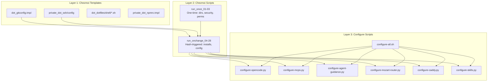
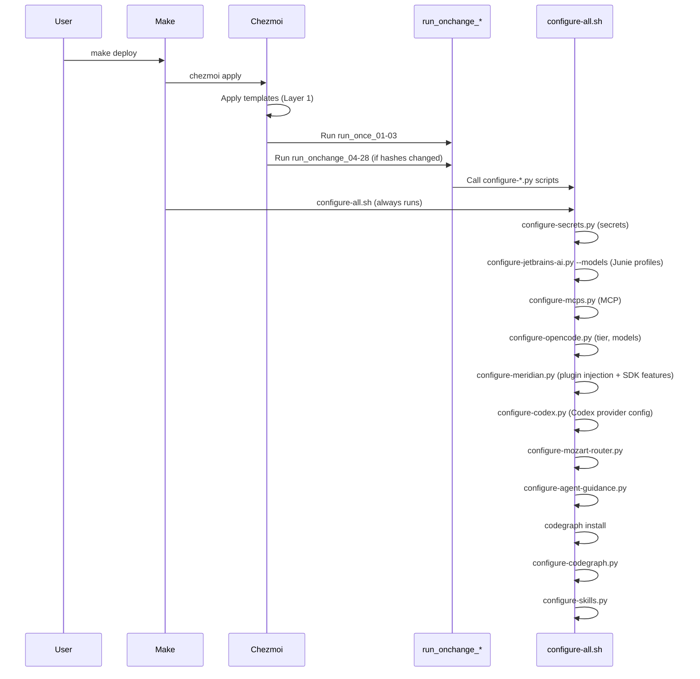
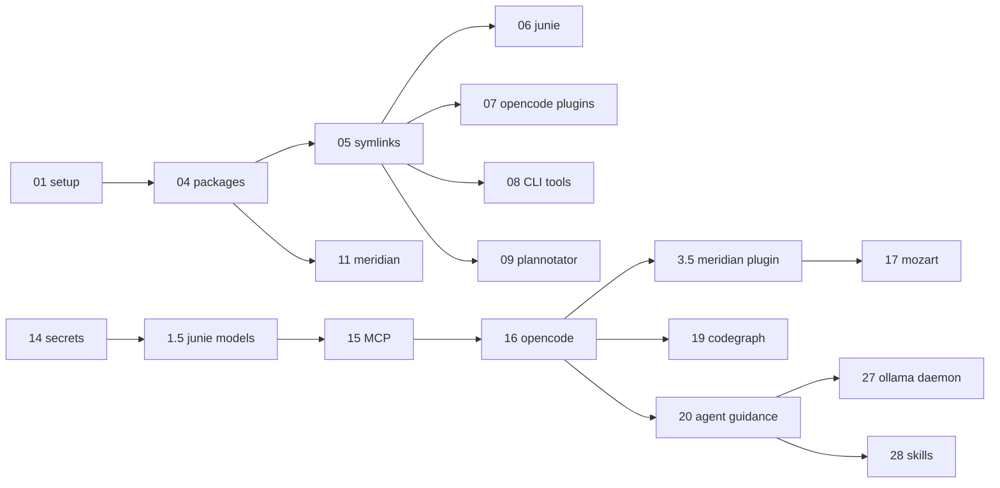

# Dotfiles Orchestration Architecture

> This document is the canonical reference for the dotfiles orchestration architecture.
> All changes to scripts, Makefile targets, or configure scripts must be evaluated
> against the principles documented here.

## Overview

The dotfiles repo uses a three-layer architecture to manage machine configuration,
with project-scoped configuration as the project-facing extension of Layer 3.
`make deploy` is the single command that reconciles a machine — it runs `chezmoi apply`
(templates + scripts) followed by `configure-all.sh` (AI tool config generators).

## Three-Layer Architecture



### Layer 1: Chezmoi Templates (`dot_*`)
- Static dotfiles: gitconfig, ssh config, shell configs, npmrc, AWS credentials
- Applied by `chezmoi apply`
- Use `{{ env "VAR" }}` to pull from `~/.env`

### Layer 2: Chezmoi Scripts (`.chezmoiscripts/`)
- `run_once_01-03`: One-time operations (directory creation, security hardening, SSH permissions)
- `run_onchange_04-28`: Hash-triggered re-runnable scripts (package installs, CLI installs, config generation)
- Bridge between templates and configure scripts
- Chezmoi sorts `run_once_*` before `run_onchange_*`, then by numeric prefix

### Layer 3: Configure Scripts (`scripts/configure-*.py`)
- Standalone idempotent config generators
- Excluded from chezmoi via `.chezmoiignore`
- Called by Layer 2 scripts AND by `configure-all.sh` (Makefile orchestration)
- Do runtime discovery (Ollama models, API keys, JetBrains paths) that templates can't
- `configure-project.py` is the unified project orchestrator. It reads
  `.opencode/.env` and runs selected project steps; generated secrets go to
  `.opencode/.env.local`.

## Execution Flow



## Makefile Targets

| Target | What it does | When to use |
|--------|-------------|------------|
| `make deploy` | `chezmoi apply` + `configure-all.sh` | After pulling changes, first setup |
| `make configure` | `configure-all.sh` only (no chezmoi apply) | Changed API keys, pulled new Ollama models |
| `make verify` | lint + drift + doctor + check-hashes + dry-run | Before committing |
| `make ci-verify` | lint + drift + doctor + check-hashes (no dry-run) | CI pipeline |
| `make doctor` | Read-only drift checks (verify generated configs exist) | Diagnosing issues |
| `make check-hashes` | Hash trigger coverage audit | After adding config inputs |
| `make reset` | Clear chezmoi script state | Force full re-run |
| `make diff` | Preview chezmoi changes | Before deploying |
| `make dry-run` | Dry-run chezmoi apply | Before deploying |
| `make lint` | Syntax + format checks | Before committing |
| `make drift` | Verify ~/.env matches .env.example (read-only) | After updating secrets |
| `make migrate` | Rename deprecated gates + append missing keys | After pulling gate renames |
| `make opencode-start` | Start OpenCode Web LaunchAgent/Service | After config regeneration |
| `make opencode-stop` | Stop OpenCode Web LaunchAgent/Service | Before config changes |
| `make opencode-restart` | Stop + start OpenCode Web | After config regeneration |
| `make plannotator-restart` | Clear Plannotator paste backend port (19433) | Port conflict resolution |
| `make services-restart` | opencode-restart + plannotator-restart | Full service restart |

## Design Decisions

1. **`make deploy` does everything** — one command reconciles the machine. No separate "rebuild" step.
2. **`run_onchange` for all re-runnable scripts** — only 3 scripts are `run_once` (dirs, security, perms). Everything else is `run_onchange` with hash triggers.
3. **Opt-in gates** — `DOTFILES_RUN_*_SETUP` env vars default to `0` for fleet management (one user, multiple machines with different needs).
4. **Hash triggers** — chezmoi detects config file changes automatically via `{{ include "path" | sha256sum }}` comments.
5. **`configure-all.sh` wrapper** — sources shared libs (`common.sh`, `tier_detect.sh`), runs configure scripts in dependency order with warn-on-fail.
6. **Idempotent scripts** — safe to run twice; `make deploy` may double-execute (chezmoi + configure-all.sh). Second run is a no-op.

## Script Inventory

| # | Script | Type | Purpose | Gate |
|---|--------|------|---------|------|
| 01 | setup-chezmoi | run_once | Dir creation, GPG perms | — |
| 02 | configure-macos-security | run_once | Firewall, Gatekeeper, FileVault | `DOTFILES_RUN_MACOS_SECURITY_SETUP` |
| 03 | configure-ssh-permissions | run_once | chmod ~/.ssh, keys | — |
| 04 | install-packages | run_onchange | Homebrew/Winget packages | `DOTFILES_RUN_PACKAGES_SETUP` |
| 05 | setup-bin-symlinks | run_onchange | Symlink scripts to ~/bin | — |
| 06 | install-junie-cli | run_onchange | Junie CLI + model profiles | `DOTFILES_RUN_JUNIE_CLI_SETUP` |
| 07 | install-opencode-plugins | run_onchange | OpenCode plugins (DCP, plannotator, oh-my-opencode-slim) | `DOTFILES_RUN_OPENCODE_TOOLS_SETUP` |
| 08 | install-ai-cli-tools | run_onchange | Standalone CLIs: openspec, codegraph | `DOTFILES_RUN_OPENCODE_TOOLS_SETUP` |
| 09 | install-plannotator | run_onchange | Plannotator CLI | `DOTFILES_RUN_PLANNOTATOR_SETUP` |
| 11 | install-meridian-launchd | run_onchange | Meridian launchd plist (macOS) | `DOTFILES_RUN_MERIDIAN_SETUP` |
| 12 | configure-macos-defaults | run_onchange | macOS user preferences | `DOTFILES_RUN_MACOS_DEFAULTS_SETUP` |
| 13 | configure-iterm2 | run_onchange | iTerm2 DynamicProfiles | — |
| 14 | configure-secrets | run_onchange | .env distribution to AI dirs | `DOTFILES_RUN_SECRETS_SETUP` |
| 15 | configure-mcp | run_onchange | MCP config generation | `DOTFILES_RUN_MCP_SETUP` |
| 16 | configure-opencode | run_onchange | OpenCode tier, models, voice | `DOTFILES_RUN_OPENCODE_SETUP` |
| 17 | configure-mozart-router | run_onchange | Mozart router config | `DOTFILES_RUN_MOZART_SETUP` |
| 19 | configure-codegraph | run_onchange | CodeGraph MCP registration | `DOTFILES_RUN_CODEGRAPH_SETUP` |
| 20 | configure-agent-guidance | run_onchange | Agent guidance distribution | `DOTFILES_RUN_AGENT_GUIDANCE_SETUP` |
| 21 | migrate-acme-ddns | run_once | Decommission legacy ACME/DDNS setup | `DOTFILES_RUN_CADDY_SETUP` |
| 22 | install-ddns-route53 | run_onchange | ddns-route53 LaunchAgent | `DOTFILES_RUN_CADDY_SETUP` |
| 23 | install-acme | run_onchange | acme.sh install + renewal hook | `DOTFILES_RUN_CADDY_SETUP` |
| 24 | install-caddy | run_onchange | Caddy install + Caddyfile generation | `DOTFILES_RUN_CADDY_SETUP` |
| 25 | install-plannotator | run_onchange | Plannotator paste install + LaunchAgent | `DOTFILES_RUN_CADDY_SETUP` |
| 26 | install-opencode-web | run_onchange | OpenCode web LaunchAgent | `DOTFILES_RUN_OPENCODE_WEB_SETUP` |
| 27 | configure-ollama-daemon | run_onchange | Ollama daemon env config | `DOTFILES_RUN_OLLAMA_DAEMON_SETUP` |
| 28 | configure-skills | run_onchange | Skills distribution to agent dirs | `DOTFILES_RUN_SKILLS_SETUP` |
| 29 | configure-project | manual/project | Unified project-scoped configuration (`--steps` selects work) | project `.opencode/.env` |

`configure-opencode-project.py` and `configure-jetbrains-workspace-project.py` are
permanent thin wrappers around `configure-project.py`. `configure-jetbrains-ai.py
--models` remains the global Junie-model path; project Junie work is delegated by
the unified script.

### Skills catalog

The skills manifest uses category files rather than a monolithic profile:

| File | Profile | Activation |
|------|---------|------------|
| `configs/skills/skills.core.json` | `core` | Always on |
| `configs/skills/skills.mattpocock.json` | `mattpocock` | Always on (no gate) |
| `configs/skills/skills.aws.json` | `aws` | `DOTFILES_RUN_SKILLS_AWS_SETUP` |
| `configs/skills/skills.mongodb.json` | `mongodb` | `DOTFILES_RUN_SKILLS_MONGODB_SETUP` |
| `configs/skills/skills.prisma.json` | `prisma` | `DOTFILES_RUN_SKILLS_PRISMA_SETUP` |

`configs/skills/skills.json` remains the index for `preinstalled` and `repo_local`.
The canonical fetched-skill cache is `~/.local/share/dotfiles/skills/`, outside
OpenCode discovery paths; `~/.agents/skills/` contains active discovery links.

## Gate Reference

All gates follow the `DOTFILES_RUN_*_SETUP` naming pattern and default to `0` (opt-in).

| Gate | Default | Controls |
|------|---------|----------|
| `DOTFILES_RUN_MACOS_DEFAULTS_SETUP` | 0 | Script 12 (macOS user preferences) |
| `DOTFILES_RUN_MACOS_SECURITY_SETUP` | 0 | Script 02 (firewall, Gatekeeper) |
| `DOTFILES_RUN_PACKAGES_SETUP` | 0 | Script 04 (Homebrew/Winget installs) |
| `DOTFILES_RUN_JUNIE_CLI_SETUP` | 0 | Script 06 (Junie CLI install) |
| `DOTFILES_RUN_OPENCODE_TOOLS_SETUP` | 0 | Scripts 07, 08 (OpenCode plugins + CLI tools) |
| `DOTFILES_RUN_PLANNOTATOR_SETUP` | 0 | Script 09 (Plannotator CLI) |
| `DOTFILES_RUN_MERIDIAN_SETUP` | 0 | Script 11 (Meridian launchd) |
| `DOTFILES_RUN_CADDY_SETUP` | 0 | Scripts 21-25 (migration, ddns-route53, acme.sh, Caddy, Plannotator) |
| `DOTFILES_RUN_OPENCODE_WEB_SETUP` | 0 | Script 26 (OpenCode web LaunchAgent) |
| `DOTFILES_RUN_OPENCODE_SETUP` | 0 | Script 16 (OpenCode tier, models, voice) |
| `DOTFILES_RUN_MCP_SETUP` | 0 | Script 15 (MCP config) |
| `DOTFILES_RUN_MOZART_SETUP` | 0 | Script 17 (Mozart router) |
| `DOTFILES_RUN_SECRETS_SETUP` | 0 | Script 14 + `configure-all.sh` (secrets distribution via configure-secrets.py; inherits from `DOTFILES_RUN_OPENCODE_SETUP`) |
| `DOTFILES_RUN_CODEGRAPH_SETUP` | 0 | Script 19 (CodeGraph MCP) |
| `DOTFILES_RUN_AGENT_GUIDANCE_SETUP` | 0 | Script 20 (agent guidance) |
| `DOTFILES_RUN_OLLAMA_DAEMON_SETUP` | 0 | Script 27 (Ollama daemon env config) |
| `DOTFILES_RUN_SKILLS_SETUP` | 0 | Script 28 + `configure-all.sh` (skills distribution via configure-skills.py) |
| `DOTFILES_RUN_SKILLS_AWS_SETUP` | 0 | Activate the AWS skills category globally |
| `DOTFILES_RUN_SKILLS_MONGODB_SETUP` | 0 | Activate the MongoDB skills category globally |
| `DOTFILES_RUN_SKILLS_PRISMA_SETUP` | 0 | Activate the Prisma skills category globally |
| `DOTFILES_RUN_VOICE_SETUP` | 0 | `run_onchange_07` (voice deps: whisper-cpp, sox, piper-tts, models) |

## Dependency Ordering



## Adding New Components

### Adding a new configure script
1. Create `scripts/configure-foo.py` (idempotent, follows naming conventions)
2. Create `run_onchange_NN-configure-foo.sh.tmpl` with hash triggers for its inputs
3. Add to `scripts/configure-all.sh` in dependency order
4. Add gate to `.env.example` if opt-in
5. Add output files to `scripts/verify-config.py` check list
6. Run `make check-hashes` to verify coverage
7. Run `make verify` to confirm

### Adding a new config input file
1. Create the file in `configs/` or `scripts/`
2. Add a hash trigger comment to the relevant `run_onchange_*` script:
   ```bash
   # configs/foo/bar.json: {{ include "configs/foo/bar.json" | sha256sum }}
   ```
3. Run `make check-hashes` to verify coverage

### Adding a new gate
1. Use `DOTFILES_RUN_*_SETUP` naming pattern
2. Document in `.env.example` with comment
3. Default to `0` (opt-in for fleet management)
4. Add to the gate reference table above

## Gate Migrations

When gate names change (e.g., `DOTFILES_RUN_*` → `DOTFILES_RUN_*_SETUP`), the migration script `scripts/migrate-env-gates.py` renames deprecated gates in `~/.env` to the current scheme. It preserves values, inherits from predecessor gates for splits, and backs up `~/.env` first.

### Migration flow for consumers

1. `git pull`
2. `make migrate` — rename old gates to new names in `~/.env` and append any still-missing new keys as commented defaults
3. Edit `~/.env` to enable new gates (set to `1`) if desired
4. `make reset` — clear orphaned chezmoi script state from renamed scripts
5. `make deploy` — full rebuild
6. `make verify` — confirm

### Adding future migrations

To add a new gate rename in the future:
1. Add a tuple to `MIGRATIONS` in `scripts/migrate-env-gates.py`: `(old_key, new_key, inherit_from)` — `inherit_from` is the key to inherit value from if the new key is absent (use `None` if no inheritance).
2. Update `dot_dotfiles/shell/.env.example` with the new gate name.
3. Run `make migrate --dry-run` to preview, then `make migrate` to apply.
4. Run `make check-hashes` and `make verify` to confirm.

The `MIGRATIONS` list is the single source of truth for gate rename history.

## Troubleshooting

| Symptom | Diagnosis | Fix |
|---------|-----------|-----|
| Config didn't update after `git pull` | Hash trigger missing or chezmoi state stale | `make check-hashes`, then `make reset && make deploy` |
| Script never runs | Gate not set in `~/.env` | Check `~/.env` for `DOTFILES_RUN_*_SETUP=1`, run `make migrate` |
| Double execution of configure scripts | Expected — chezmoi + configure-all.sh both run | Scripts are idempotent; second run is a no-op |
| `make deploy` is slow (30+ seconds) | All configure scripts running | This is expected for full rebuild. Use `make diff` to preview |
| `configure-all.sh` fails on tier detection | `tier_detect.sh` needs `common.sh` | `configure-all.sh` sources both — if error, check lib paths |
| `make doctor` reports missing files | Gate enabled but configure script didn't run | Run `make configure` to regenerate, then `make doctor` again |
